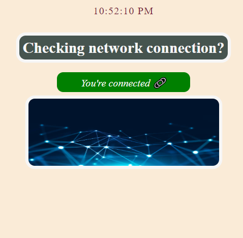

# Network connection checking

- App showing the network status and display image and txt accordingly

## Demo
- Click the link below and change network setting to see the app affect
### https://on-and-off.vercel.app/

<h5>When connected display will show below:</h5>

<h5>When no internet connection display will show below:</h5>

